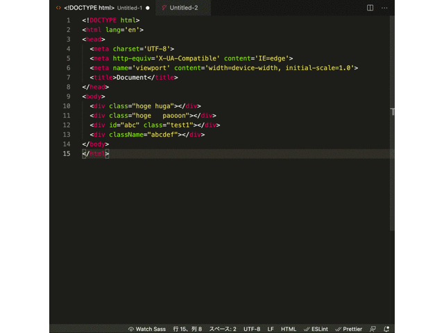
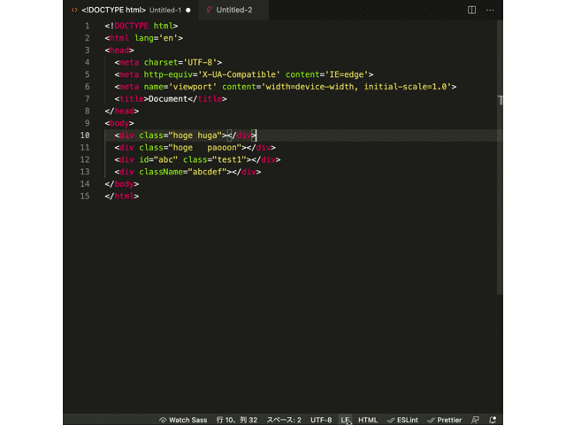
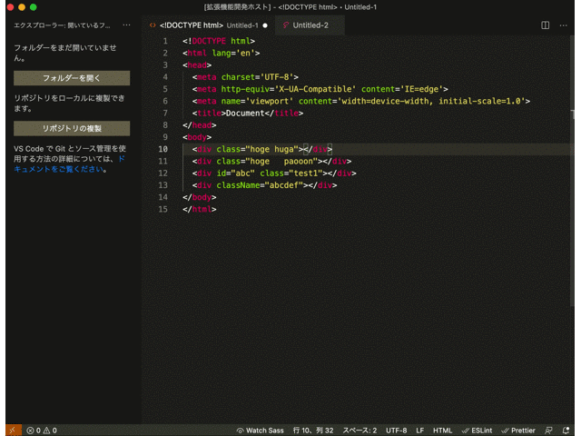

# extractionCssSelector

Generate css selector from html

## Features

- html タグから「class」 と 「className」を抽出して css セレクターを生成します。
- 重複したセレクターを１つにまとめられます。
- 「現在アクティブのファイル全体」、「選択範囲内」からと抽出範囲を選べます。
  範囲選択していない場合は、ファイル全体になります。
- 生成された css セレクターは、クリップボードにコピーされます。
- 生成されるセレクター内に、任意の文字列を挿入することが可能です。

## Capture

### ドキュメント全体から生成



### 選択範囲から生成



### ドキュメント全体から生成 & 任意の文字列を挿入



#### 【ex】

```scss
@include pc {
}
\n @include sp {
}
```
