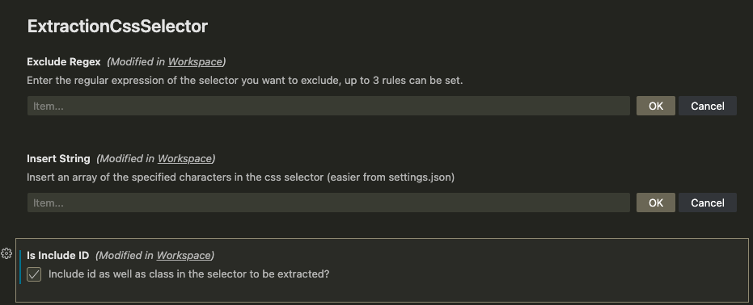
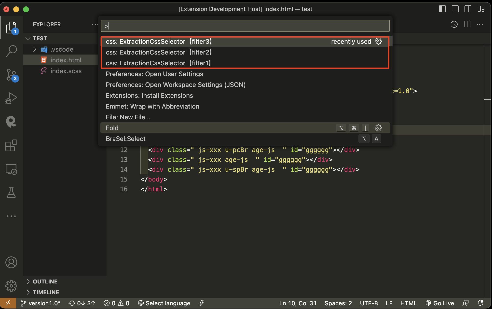
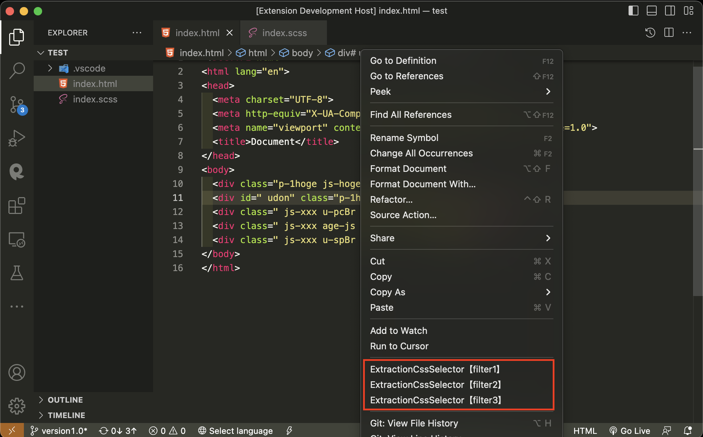

# extractionCssSelector

**EN**

- Generate css selector from html

**JA**

- html タグから css セレクターを生成します

## Marketplace URL

<a target="_blank" href="https://marketplace.visualstudio.com/items?itemName=gonishiduka1985.extractioncssselector">https://marketplace.visualstudio.com/items?itemName=gonishiduka1985.extractioncssselector</a>

## Features

**EN**

- Extracts "class" and "className" from the html tag and generates a css selector.
- Optionally, you can choose to extract the "id" as well.
- Combine duplicate selectors into one.
- You can select the extraction range from "the entire currently active file" or "within the selected range".
- If no range is selected, the entire file will be selected.
- **The generated css selector will be copied to the clipboard.**
- Any string can be inserted in the generated selector.
- A filter can be set to exclude selectors with specific strings.
- Up to three filters can be set, corresponding to the three commands when invoked.

**JA**

- html タグから「class」 と 「className」を抽出して css セレクターを生成します。
- オプションで「id」も抽出するかを選択出来ます。
- 重複したセレクターを１つにまとめます。
- 抽出範囲を「現在アクティブのファイル全体」「選択範囲内」から選べます。
- **範囲選択されてない場合は、ファイル全体になります。**
- 生成された css セレクターは、クリップボードにコピーされます。
- 生成されるセレクター内に、任意の文字列を挿入することが可能です。
- 特定の文字列が入ったセレクターを除外するフィルターの設定が可能です。
- フィルターは３つまで設定出来て、呼び出す時の３つのコマンドと対応しています。

## Options

| configuration properties | type             | default | maxItems | description                                  |
| ------------------------ | ---------------- | ------- | -------- | -------------------------------------------- |
| insertString             | string[]         | []      | -        | Insert characters to be inserted in an array |
| isIncludeId              | boolean          | false   | -        | Include id?                                  |
| excludeRegex             | string[] (Regex) | []      | 3        | Set up an array of rules to exclude          |

## Usage

**EN**

Right click or select one of the following three from the command palette <br>
filter 1〜3 corresponds to the 1st〜3rd in the "excludeRegex" array. <br>
This allows you to set up different regular expressions and use different filters for different situations.

- 「ExtractionCssSelector【filter1】」
- 「ExtractionCssSelector【filter2】」
- 「ExtractionCssSelector【filter3】」

**JA**

右クリックか、コマンドパレットから以下の３つのうちの１つを選択。<br>
filter の 1〜3 は「excludeRegex」の配列の 1〜3 番目と対応しています。<br>
これにより、それぞれ違う正規表現を設定して、場面に応じてフィルターの使い分けが出来ます。

- 「ExtractionCssSelector【filter1】」
- 「ExtractionCssSelector【filter2】」
- 「ExtractionCssSelector【filter3】」

## Settings example （settings.json）

```javascript

{
  "extractioncssselector.insertString": [
    "  @include pc() {",
    "",
    "  }",
    "  @include sp() {",
    "",
    "  }"
  ],
  "extractioncssselector.isIncludeId": true,
  "extractioncssselector.excludeRegex": ["", "^(\\.is-|\\.js-)", "^(\\.u-)"]
}


```

## Settings example （UI）



## Capture

### Run from command palette



### Run from context menu


